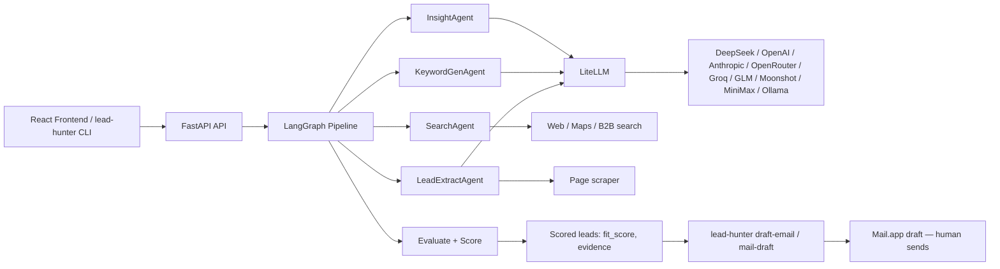
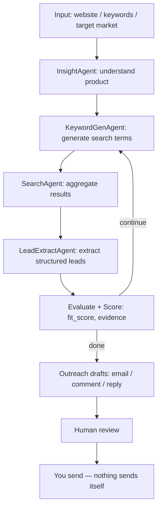

# Codex-native Lead Hunter

> Open-source AI lead generation agent for Codex. Find prospects, research companies, score leads, generate personalized outreach, and create Mail.app drafts — with a human approving every send.

[](./LICENSE)
[](https://python.org)
[](https://fastapi.tiangolo.com)
[](https://react.dev)
[](https://github.com/langchain-ai/langgraph)
[](https://platform.deepseek.com)
[](./skills/codex-native-lead-hunter/SKILL.md)

**Runs locally · uses your own API keys · DeepSeek-first · Codex / Claude Code / Cursor compatible · Chrome-assisted lead verification · macOS Mail.app draft generation · human approval before every send · no spam, no black-box SaaS.**

中文简介：**开源 Codex 自动获客 Agent：本地运行，DeepSeek 驱动，自动找客户、评分、写邮件草稿,发送前人工确认。**

---

## Why this exists

Most "AI SDR" tools are closed-source SaaS: your product data, your prospect list, and your API keys all live on someone else's server, and outreach fires automatically the moment a lead clears some invisible threshold. Codex-native Lead Hunter takes the opposite bet:

- **Local-first.** The agent runs on your machine against your own LLM/API keys. Lead data never has to leave it.
- **Codex-native.** It's built to be *driven by* an agentic coding assistant (Codex, Claude Code, Cursor) through a documented [Skill](./skills/codex-native-lead-hunter/SKILL.md) and CLI, not just clicked through a dashboard.
- **Human-in-the-loop by construction.** Every outbound action — an email, a comment, a DM — stops at a draft. Nothing sends itself. See the [Safety Model](#human-approval-safety-model) below.
- **Evidence over guesses.** Every lead is backed by a source URL you can open and check yourself, not a scraped list with no paper trail.

## Features

- **Multi-agent discovery pipeline** — `Insight → KeywordGen → Search → LeadExtract → Evaluate`, orchestrated with LangGraph, iterating rounds until your target lead count or quality threshold is hit.
- **DeepSeek-first, provider-agnostic** — ships configured for DeepSeek out of the box; swap in OpenAI, Anthropic, OpenRouter, Groq, GLM, Moonshot, MiniMax, or a local Ollama model via one env var (LiteLLM under the hood).
- **Lead scoring** — every lead gets `business_value`, `urgency`, `fit_score`, `confidence`, a `recommended_action`, and cited `evidence`. Only `fit_score >= 7` leads enter the outreach queue.
- **Codex Skill + CLI (`lead-hunter`)** — run hunts, inspect leads, generate outreach drafts, and export results from Codex, Claude Code, Cursor, or a plain terminal.
- **macOS Mail.app drafts** — generates a real Mail.app draft (subject, body, recipient) via AppleScript. It is never sent automatically — you review and hit send yourself.
- **Browser-assisted verification** — opens each lead's source URL / company site / social profile so you (or Codex driving your browser) can confirm it's real before it goes anywhere near an outreach queue.
- **Multi-channel search** — Google Search, Google Maps, and B2B directory search feed the pipeline; adaptive scraping per URL type.
- **Contact discovery** — extracts emails, phone numbers, addresses, and social links from crawled pages.
- **Real-time progress** — FastAPI + SSE streams pipeline stage/round progress to the React frontend.
- **Cost tracking** — optional Langfuse integration records LLM cost, tokens, and latency per hunt.

## How it works





## Quick Start

Requires Python 3.11+, Node 18+, and (optionally) macOS for Mail.app drafts.

```bash
git clone https://github.com/yangshun2005/Codex-native-Lead-Hunter.git
cd Codex-native-Lead-Hunter/backend
cp .env.example .env        # then fill in DEEPSEEK_API_KEY (see below)
python -m venv .venv && source .venv/bin/activate
pip install -r requirements.txt
uvicorn api.app:app --reload --port 8000
```

In a second terminal, run the frontend (optional — everything is also reachable via the CLI/API):

```bash
cd Codex-native-Lead-Hunter/frontend
npm install
npm run dev
```

Then either open the web UI at `http://localhost:3000`, or drive it entirely from the terminal / Codex:

```bash
cd Codex-native-Lead-Hunter/backend
python -m cli.lead_hunter init
python -m cli.lead_hunter run --product "AI automation agency" --market "dentists in California"
python -m cli.lead_hunter leads list
```

## DeepSeek Setup

DeepSeek is the recommended default provider — cheap, fast, OpenAI-compatible, and works well for both extraction and reasoning steps.

1. Get a key at [platform.deepseek.com/api_keys](https://platform.deepseek.com/api_keys).
2. In `backend/.env`:
   ```bash
   LLM_PROVIDER=deepseek
   DEEPSEEK_API_KEY=sk-...
   DEEPSEEK_BASE_URL=https://api.deepseek.com
   DEEPSEEK_MODEL=deepseek-chat

   LLM_MODEL=deepseek/deepseek-chat
   REASONING_MODEL=deepseek/deepseek-reasoner
   ```
3. Start the backend. If `DEEPSEEK_API_KEY` (or whichever key your `LLM_MODEL`/`REASONING_MODEL` needs) is missing, the server logs a clear startup warning telling you exactly which env var to set — it won't fail silently mid-hunt.

Other providers (OpenAI, Anthropic, OpenRouter, Groq, GLM, Moonshot, MiniMax, local Ollama) work the same way — just point `LLM_MODEL` / `REASONING_MODEL` at a different `provider/model` string and set the matching API key. See `backend/.env.example` for the full list.

## Codex Skill Setup

Codex-native Lead Hunter ships a [Skill](./skills/codex-native-lead-hunter/SKILL.md) so Codex, Claude Code, or Cursor can drive the whole workflow — create a hunt, inspect leads, generate outreach drafts, open sources for verification, and create Mail.app drafts — without you hand-writing API calls.

```bash
# Point your agent's skill/plugin directory at:
skills/codex-native-lead-hunter/SKILL.md
```

Then just ask your agent things like:

> "Use lead-hunter to find AI automation prospects among dentists in California, then draft outreach for anything scoring fit_score >= 7."

The skill will never send an email or post a comment on its own — see [SAFETY.md](./SAFETY.md).

## macOS Mail.app Drafts

```bash
python -m cli.lead_hunter mail-draft --lead-id <id>
```

This creates a real Mail.app draft — recipient, subject, body, plus the lead id and source URL for traceability — and **stops there**. **Sending requires you to open Mail.app and click Send yourself.** If Mail.app isn't available (non-macOS, or Mail.app not configured), the command returns `manual_required` instead of failing silently. If the lead has no email, it returns `needs_input`.

## Example Workflows

See [`examples/`](./examples) for runnable end-to-end scenarios:

- [`local-business-leads/`](./examples/local-business-leads) — AI automation agency prospecting dentists in California.
- [`github-project-prospecting/`](./examples/github-project-prospecting) — developer tool looking for open-source maintainers to partner with.
- [`reddit-opportunity-finder/`](./examples/reddit-opportunity-finder) — surfacing people complaining about manual outreach tools (comment drafts only — nothing is auto-posted).
- [`export-to-csv/`](./examples/export-to-csv) — exporting a scored lead list for your CRM.

## Human Approval Safety Model

Read the full policy in [SAFETY.md](./SAFETY.md). The short version:

- **No auto-send, anywhere.** Email, comments, DMs — everything stops at a draft.
- **No CAPTCHA, login, or platform permission bypass.**
- **No mass/spam blasting.** The scoring gate (`fit_score >= 7`) and low default batch sizes exist to keep outreach small and personalized.
- **You are responsible** for complying with each platform's terms of service and applicable anti-spam law (e.g. CAN-SPAM, GDPR, PECR) in your jurisdiction.

## Roadmap

See [ROADMAP.md](./ROADMAP.md) for the full list. Highlights:

- [x] Multi-agent lead discovery pipeline (LangGraph)
- [x] DeepSeek-first provider config
- [x] `lead-hunter` CLI
- [x] macOS Mail.app draft generation
- [x] Lead scoring (`fit_score`, `evidence`, etc.)
- [ ] Native Chrome/Playwright-driven verification (currently: open-in-browser + manual notes)
- [ ] Reddit/X/LinkedIn draft-comment helpers beyond the example scripts
- [ ] Windows/Linux outreach-draft equivalent to Mail.app (e.g. `.eml` export)

## Comparison

| | Apollo | Clay | Instantly | n8n workflow | **Codex-native Lead Hunter** |
|---|---|---|---|---|---|
| Open source | ❌ | ❌ | ❌ | ✅ (workflow only) | ✅ |
| Local-first, your data stays put | ❌ | ❌ | ❌ | ⚠️ depends on nodes used | ✅ |
| Bring your own LLM API key | ❌ | ⚠️ partial | ❌ | ⚠️ depends on nodes used | ✅ (DeepSeek-first) |
| Codex/Claude Code/Cursor-native | ❌ | ❌ | ❌ | ❌ | ✅ |
| Human approval required before send | ⚠️ optional | ⚠️ optional | ⚠️ optional | ⚠️ depends on workflow | ✅ by default |
| Pricing | Per-seat SaaS | Per-seat SaaS | Per-seat SaaS | Free (self-hosted) | Free (self-hosted) |

## Credits

Built on top of the open-source [AI_Find_Customer](https://github.com/xiongQvQ/AI_Find_Customer) B2B lead-hunting pipeline. See [LICENSE](./LICENSE) for the MIT terms this project is distributed under.

## Contributing

See [CONTRIBUTING.md](./CONTRIBUTING.md). Bug reports, examples, and additional platform integrations (that respect the [safety model](#human-approval-safety-model)) are welcome.
